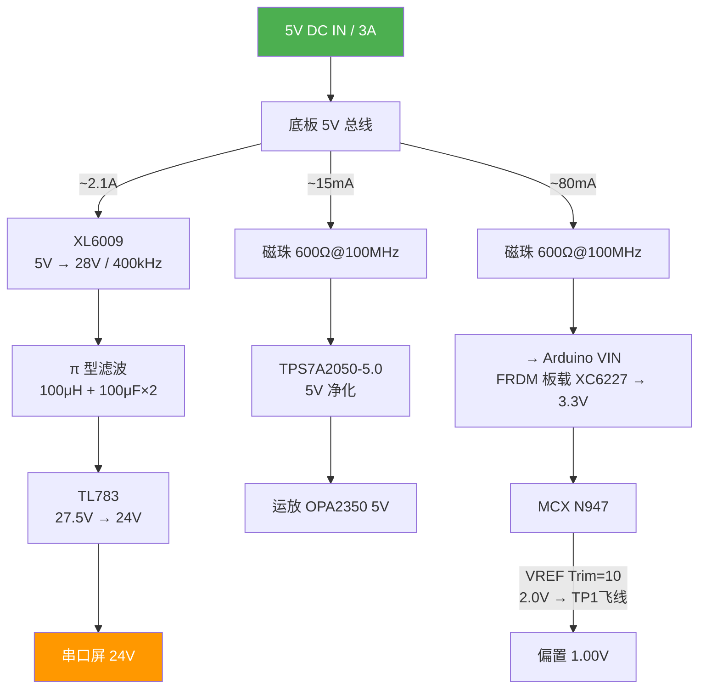
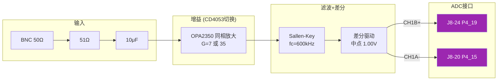

# 周期信号测量分析装置 —— 电源及模拟前端方案

> 2026 年 TI 杯 G 题 | FRDM-MCXN947 + 自制底板 | 单路 5V DC 供电

---

## 1. 系统架构

```
┌──────────────────────────────────────────────────────────┐
│                    自制底板（Shield PCB）                   │
│                                                          │
│  ┌─────────────┐    ┌──────────────────┐                 │
│  │  5V DC 输入  │    │  24V 电源模块     │                 │
│  │  (端子)     │───→│  Boost → π → LDO │──→ 串口屏 24V   │
│  └─────────────┘    └──────────────────┘                 │
│         │                                               │
│         ├────→ [5V 滤波 + 磁珠] ──→ Arduino VIN ──→ FRDM │
│         │                                               │
│         └────→ [低噪 LDO 5V] ──→ 运放电源               │
│                                                          │
│  ┌──────────────────────────────────────┐                │
│  │  模拟前端                             │                │
│  │  BNC → AC耦合 → 程控增益 → 滤波 → 差分 │                │
│  │                          ↓            │                │
│  │              J8 Pin 20/24 (CH1A/CH1B) │                │
│  └──────────────────────────────────────┘                │
│                                                          │
│  ┌──────────────────────────────────────┐                │
│  │  对外接口                             │                │
│  │  · Arduino UNO 排母 (接 FRDM)         │                │
│  │  · 串口屏 4P (GND/24V/TX/RX)         │                │
│  │  · 按键 ×3 / BNC ×1                  │                │
│  └──────────────────────────────────────┘                │
│                                                          │
│  ╔══════════════════════════════════════╗                │
│  ║   FRDM-MCXN947  (Arduino 排母插入)    ║                │
│  ║   MCX N947: 双核 M33@150M, 16b ADC   ║                │
│  ║   PowerQuad 硬件FFT, XC6227 LDO      ║                │
│  ╚══════════════════════════════════════╝                │
└──────────────────────────────────────────────────────────┘
```

### 信号流


---

## 2. 电源树



### 电流预算

| 支路 | 电压 | 电流 | 功耗 |
|------|------|:---:|------|
| 串口屏 | 24V | 300 mA | 7.2 W |
| FRDM 板 | 5V (VIN) | 80 mA | 0.4 W |
| 运放前端 | 5V (低噪) | 15 mA | 0.075 W |
| Boost 损耗 | — | — | ~1.5 W |
| **5V 输入合计** | 5V | **~2.2 A** | **~11 W** |

---

## 3. 底板电路

### 3.1 Boost：XL6009 (5V → 28V)

| 元件 | 型号/值 |
|------|---------|
| U1 | XL6009 TO-263-5, 400kHz, 4A |
| L1 | CD54-220M, 22μH / 3A 屏蔽 |
| D1 | SS56, 60V/5A 肖特基 |
| R1, R2 | 22kΩ, 1kΩ (1%), Vout ≈ 28.75V |
| Cin | 100μF/16V 铝 + 0.1μF MLCC |
| Cout | 100μF/50V 铝 + 10μF MLCC |
| Cff | 470pF C0G (FB→GND) |

```
                    ┌────────────────────────────┐
                    │         XL6009             │
5V_IN ──┬── 100μF ──┤ VIN                  SW  ├──┬── L1 22μH ──┬── D1 SS56 ──┬── 28V OUT
        │    +0.1μF  │                    (4)  │  │              │             │
        │            │ EN                   FB ├──┤              │    ┌── 100μF/50V
        │            │                    (5)  │  │              │    ├── 10μF MLCC
        └────────────┤ GND                    │  │              │    │
                     └────────────────────────┘  │              │    │
                                                 R1 22kΩ        │    │
                                                 ├── Cff 470p ──┤    │
                                                 R2 1kΩ         │    │
                                                 GND            GND  GND
```

### 3.2 π 型滤波 + LDO

```
28V ──┬── L 100μH/1A (CDRH127) ──┬── 27.5V ──→ TL783 ──→ 24V
      │                          │            IN    OUT
    100μF/50V                  100μF/50V      ├─10μF钽  ├─10μF钽
    + 0.1μF                    + 10μF MLCC    │         │
      │                          │           GND       GND
     GND                        GND
```

TL783: R3=82Ω, R4=1.5kΩ → $V_{out} = 1.25 \times (1 + \frac{1500}{82}) \approx 24.1\text{V}$, $P_d \approx 1\text{W}$，加 14×14mm 散热片。

### 3.3 运放电源：TPS7A2050-5.0

| 参数 | 值 |
|------|-----|
| 输入 | 5V (经磁珠) |
| 输出 | 5V 固定, SOT-23-5 |
| 噪声 | 7 μVrms (10Hz~100kHz) |
| PSRR @ 400kHz | ≥ 45 dB |
| 压差 | 140 mV @ 50mA |

```
5V (from FB2) ──┬── TPS7A2050-5.0 ──┬── 5V_CLEAN
                │   IN    OUT       │
                │   EN    GND       │
                │   (接高)  │        │
              1μF          1μF
                │           │
               GND         GND
```

### 3.4 VREF 配置

MCX N947 片上 VREF，`VREF_SetTrimVal()` API, 6-bit Trim, 0.5mV/step。

| Trim | VREF_OUT | 偏差 |
|:---:|------|:---:|
| 0 | 1.000 V | ±0 |
| 5 | 1.498 V | -2 mV |
| 8 | 1.801 V | +1 mV |
| **10** | **1.997 V** | **-3 mV** |
| 11 | 2.096 V | -4 mV |

**Trim=10 → ADC 输入 0~2.0V。** VREF_OUT 在 TP1 测试点，飞线引到底板。

```
FRDM:  TP1 (VREFO) ──飞线──→ 底板偏置电路
       J8-20 (P4_15 / CH1A) ←── 差分输出-
       J8-24 (P4_19 / CH1B) ←── 差分输出+
```

### 3.5 偏置电压

```
TP1 VREF_OUT (2.0V) ──┬── R1 10kΩ ──┬── 1.00V ──→ 跟随器 (+) ──→ V_BIAS
                       │              │
                       │              R2 10kΩ
                       │              │
                       └──────────────┴── GND
```

从 VREF 分压而非 3.3V 分压——VREF 是 ADC 实际参考，两者同源同漂移，共模抵消。

---

## 4. 模拟前端

### 4.1 设计指标

| 参数 | 值 |
|------|-----|
| 输入 | 50 mVpp ~ 250 mVpp, 10k~500kHz |
| ADC | LPADC0 差分 CH1B-CH1A, VREF=2.0V |
| 目标摆幅 | ~1.75 Vpp (0.125V~1.875V) |
| 中点 | 1.00V |
| 输入阻抗 | 50Ω (BNC 端接) |

### 4.2 增益

| 档位 | 增益 | 适用 | 输出 |
|------|:---:|------|:---:|
| 低 | **7×** | 250mVpp | 1.75Vpp |
| 高 | **35×** | 50mVpp | 1.75Vpp |

### 4.3 电路框图



### 4.4 程控增益

```
         ┌── Rf1 60.4kΩ ────┐
         │                   │
Vin ─────┴── Rf2 340kΩ ─────┴──┬── Vout
              │                 │
              ├── SW1 ── GND    Rg 10kΩ
              │                 │
              └── SW2 ── GND    GND

G = 1 + Rf/Rg
SW1闭,SW2断: Rf=60.4k, G = 7.0×
SW1断,SW2闭: Rf=340k,  G = 35×
```

SW1/SW2 由 FRDM 的 D11(P0_24) / D12(P0_26) 接 CD4053 控制。

备选 E24 阻值: 62kΩ + 330kΩ → G≈7.2×/34×，偏差 <3%，软件校准。

### 4.5 抗混叠滤波

Sallen-Key 二阶 Butterworth, $R_1=R_2=1.5\text{k}\Omega$, $C_1=220\text{pF}$, $C_2=100\text{pF}$:

$$f_c = \frac{1}{2\pi \times 1.5\text{k} \times \sqrt{220\text{p} \times 100\text{p}}} \approx 610\text{ kHz}$$

500kHz 衰减 <3dB, 1MHz 衰减 >20dB。

### 4.6 差分输出级

```
                    ┌── R3 10kΩ ──────────── Vout- (CH1A, J8-20)
                    │
Vin_single ── R1 ──┴── 运放 (-) ──┬── R4 10kΩ ── Vout+ (CH1B, J8-24)
                    │             │
                V_BIAS (1.00V)    R2 10kΩ
                                  │
                                 GND
```

- Vout+ = 信号 + 1.00V, Vout- = 1.00V - 信号
- 差模 = 2 × 信号, 共模 = 1.00V
- 差分 CMRR 抑制 Boost 开关共模噪声

### 4.7 保护

```
Vout+ ──┬── R 100Ω ──┬──→ J8-24 (P4_19)
        │            │
        ├── BAT54S ──┤ 阴极→VDD_ANA(3.3V)
        │            │ 阳极→GND
        └────────────┘
(Vout- 同理 → J8-20)
```

正常 0.125~1.875V 不触发，ESD/过冲时钳位。

---

## 5. FRDM 接口映射

### 5.1 J8 FlexIO 排针 — 模拟信号

J8 为 2×14 双排针 (2.54mm)，底板焊 28P 排母。

| J8 引脚 | MCU 引脚 | LPADC 通道 | 底板连接 | 用途 |
|:---:|:---:|:---:|------|------|
| **20** | P4_15 | CH1A | 差分 - | 主 ADC |
| **24** | P4_19 | CH1B | 差分 + | 主 ADC |
| 28 | P4_23 | CH2A | 备用单端 | 调试 |
| 2 | GND | — | GND | 共地 |

### 5.2 Arduino 排母 — 供电 + 数字 IO

| Arduino Pin | MCU Pin | 底板连接 | 功能 |
|------|:---:|------|------|
| J3-10 (VIN) | VIN | 5V 底板→FRDM | 供电 |
| J1-8 (GND) | GND | GND | 共地 |
| J1-2 (D2) | P0_6 | 按键 1 | 波形/频谱切换 |
| J1-4 (D3) | P0_7 | 按键 2 | 1周期/3周期 |
| J1-6 (D4) | P0_10 | 按键 3 | 通道 A/B |
| J2-8 (D11) | P0_24 | →CD4053 SW1 | 增益低档 |
| J2-10 (D12) | P0_26 | →CD4053 SW2 | 增益高档 |

**TP1 (VREFO)** 焊接飞线引到底板偏置电路。

### 5.3 串口屏连接

| 底板端子 | 连接 | FRDM 来源 |
|------|------|------|
| GND | 底板 GND | J8-2 / Arduino GND |
| 24V | TL783 输出 | — |
| TX | P3_8 (FC2) | mikroBUS J5 飞线 |
| RX | P3_9 (FC2) | mikroBUS J5 飞线 |

---

## 6. 软硬件分工

### 底板（纯硬件）

| 功能 | 电路 |
|------|------|
| 5V→24V | XL6009 + TL783 |
| 运放供电 | TPS7A2050-5.0 |
| FRDM 供电 | 磁珠 + 电容 → Arduino VIN |
| VREF 参考 | TP1 飞线 → 分压缓冲 → 1.00V 偏置 |
| 信号调理 | AC耦合 → 程控增益(CD4053) → SK滤波 → 差分驱动 |
| 保护 | BAT54S 钳位 |

### FRDM（软件）

| 功能 | 实现 |
|------|------|
| ADC | DMA 双缓冲, 4096点 @ 2MSPS |
| FFT | PowerQuad CFFT, CMSIS-DSP API |
| 基频/幅值 | 峰值搜索 + 谐波验证 |
| 峰峰值/有效值 | 时域极值 + RMS 积分 |
| 显示 | UART → 串口屏 |
| 增益控制 | 根据幅值自动切换 CD4053 |

---

## 7. BOM

### 7.1 电源

| 序号 | 元件 | 型号 | 封装 | 数量 |
|:---:|------|------|------|:---:|
| U1 | Boost IC | XL6009 | TO-263-5 | 1 |
| L1 | 电感 22μH/3A | CD54-220M 屏蔽 | 5.8×5.2 | 1 |
| D1 | 肖特基 60V/5A | SS56 | SMC | 1 |
| U2 | 高压 LDO | TL783 | TO-220-3 | 1 |
| L2 | 电感 100μH/1A | CDRH127-101MC 屏蔽 | 12×12 | 1 |
| U3 | 低噪 LDO | TPS7A2050-5.0 | SOT-23-5 | 1 |
| FB1,2 | 磁珠 | BLM31PG601SN1 600Ω@100MHz | 1206 | 2 |
| — | 铝电解 100μF/16V | — | D6.3 | 1 |
| — | 铝电解 100μF/50V | — | D8.0 | 3 |
| — | 钽电容 10μF/50V | — | D型 | 2 |
| — | MLCC 10μF/50V X7R | — | 1206 | 4 |
| — | MLCC 0.1μF/50V X7R | — | 0805 | 6 |
| — | C0G 470pF/50V | — | 0603 | 2 |
| — | R 22kΩ, 1kΩ, 82Ω, 1.5kΩ/1% | — | 0805 | 各1 |
| — | 散热片 14×14mm 铝 | — | TO-220 | 1 |

### 7.2 模拟前端

| 序号 | 元件 | 型号 | 封装 | 数量 |
|:---:|------|------|------|:---:|
| U4 | 双运放 RRIO | OPA2350 | SOIC-8 | 2 |
| U5 | 模拟开关 | CD4053 | SOIC-16 | 1 |
| D2 | 双肖特基 | BAT54S | SOT-23 | 4 |
| — | MLCC 10μF/16V | — | 0805 | 2 |
| — | R 51Ω, 10kΩ, 60.4kΩ, 340kΩ/1% | — | 0805 | 各1 |
| — | R 10kΩ/1% (差分/偏置) | — | 0805 | 10 |
| — | R 1.5kΩ/1% (SK滤波) | — | 0805 | 4 |
| — | R 100Ω (保护) | — | 0805 | 4 |
| — | C0G 220pF | — | 0603 | 2 |
| — | C0G 100pF | — | 0603 | 2 |

### 7.3 接插件

| 元件 | 型号 | 数量 |
|------|------|:---:|
| DC 电源座 | 5.5/2.1mm | 1 |
| BNC 母座 | 50Ω PCB | 1 |
| 接线端子 | 4P 5.08mm | 1 |
| Arduino 排母 | UNO 套装 ×4 | 1 |
| 排母 | 2×14P 2.54mm (J8) | 1 |
| 排针 | 4P 2.54mm (SWD) | 1 |
| 按键 | 6×6mm 轻触 | 3 |

---

## 8. 测试方案

### 分级上电

| 步骤 | 验证 |
|:---:|------|
| 不插 FRDM，5V 上电 | Boost 28V±1V, TL783 24.1V±0.2V |
| 24V 接 82Ω/10W 假负载 | 纹波 <10mVpp, TL783 <60°C |
| 插入 FRDM | VIN 4.8~5.0V, 板 LED 亮 |
| 运放供电 | TPS7A2050 5.0V±0.05V |
| VREF Trim=10 | VREF_OUT = 2.0V±10mV |
| 偏置 & 共模 | V_BIAS = 1.00V, 差分共模 ~1.00V |

### 信号通路

| 步骤 | 验证 |
|:---:|------|
| BNC 短接 (50Ω) | ADC 差分 ≈ 0, 共模 ≈ 1.00V |
| 100mVpp / 10kHz | 差分 Vpp ≈ 1.4V (7×) |
| 50mVpp / 500kHz | 自动切 35×, 波形可辨 |
| Boost 开/关对比 | ADC 噪声增量 < 2 LSB |

### 赛题验证

| 项目 | 指标 |
|------|------|
| 峰峰值 | 误差 ≤ 5mV |
| 有效值 | 误差 ≤ 5mV (真有效值) |
| 频谱分量幅值 | 误差 ≤ 5mV |
| 干扰抑制 | 1MHz/200mVpp 干扰下频谱分量正常 |
