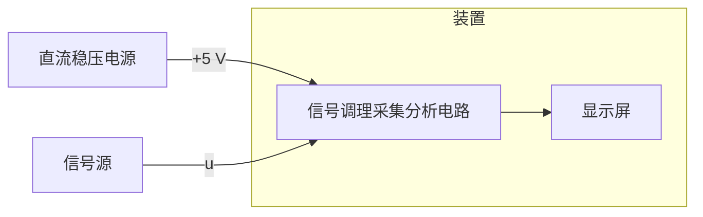

# 周期信号测量分析装置（G 题）
> 2026 年全国大学生电子设计竞赛赛区赛（TI 杯）暨模拟电子系统设计专题赛选拔赛赛题
---

## 一、任务

设计制作周期信号测量分析装置（以下简称“装置”），可对信号源输出的周期信号 $u$ 进行测量与分析，信号源输出阻抗为 $50\Omega$。装置既能在显示屏上稳定显示 $u$ 的波形图或电压频谱图，也能稳定显示 $u$ 的时域或频域相关参数值，频率分辨率为 **500 Hz**。

装置组成框图如下。

## 二、要求

### 1. 输入信号 $u=u_a$

- 电压峰峰值 $U_{pp}=100\text{ mV}\sim250\text{ mV}$。
- 所有频率成分均在 $10\text{ kHz}\sim200\text{ kHz}$ 范围内。
- 启动装置后，以下每一项的完成时间均不超过 **2 秒**。

| 项目 | 要求 | 分值 |
| --- | --- | ---: |
| 1.1 | 键控选择一屏显示 $u_a$ 的 1 个或者 3 个完整周期波形。 | 6 |
| 1.2 | 显示 $u_a$ 的电压峰峰值 $U_{pp}$、有效值 $U_{rms}$，两者误差绝对值均 $\leq5\text{ mV}$；显示 $u_a$ 的基频值 $f_{a1}$，误差绝对值 $\leq1\text{ kHz}$。 | 13 |
| 1.3 | 定性显示 $u_a$ 的电压频谱图。 | 5 |
| 1.4 | 显示 $u_a$ 的电压频谱各分量的幅值，误差绝对值 $\leq5\text{ mV}$。 | 9 |

### 2. 输入信号 $u=u_b$

- 电压峰峰值为 $50\text{ mV}\sim250\text{ mV}$。
- 所有频率成分均在 $10\text{ kHz}\sim500\text{ kHz}$ 范围内。
- 启动装置后，以下每一项的完成时间均不超过 **2 秒**。

| 项目 | 要求 | 分值 |
| --- | --- | ---: |
| 2.1 | 键控选择一屏显示 $u_b$ 的 1 个或者 3 个完整周期波形。 | 6 |
| 2.2 | 显示 $u_b$ 的电压峰峰值 $U_{pp}$、有效值 $U_{rms}$，两者误差绝对值均 $\leq5\text{ mV}$；显示 $u_b$ 的基频值 $f_{b1}$，误差绝对值 $\leq1\text{ kHz}$。 | 13 |
| 2.3 | 定性显示 $u_b$ 的电压频谱图。 | 5 |
| 2.4 | 显示 $u_b$ 的电压频谱各分量的幅值，误差绝对值 $\leq5\text{ mV}$。 | 9 |

### 3. 输入信号 $u=u_b+u_J$

- 被测信号 $u_b$ 的电压峰峰值为 $50\text{ mV}\sim250\text{ mV}$，所有频率成分均在 $10\text{ kHz}\sim500\text{ kHz}$ 范围内。
- 单频干扰 $u_J$ 的电压峰峰值为 $200\text{ mV}$，频率 $f_J\geq1\text{ MHz}$。
- 装置应在抑制单频干扰 $u_J$ 影响的基础上完成以下各项；启动装置后，每一项完成时间均不超过 **2 秒**。

| 项目 | 要求 | 分值 |
| --- | --- | ---: |
| 3.1 | 键控选择一屏显示 $u_b$ 的 1 个或者 3 个完整周期波形。 | 6 |
| 3.2 | 显示 $u_b$ 的电压峰峰值 $U_{pp}$、有效值 $U_{rms}$，两者误差绝对值均 $\leq5\text{ mV}$；显示 $u_b$ 的基频值 $f_{b1}$，误差绝对值 $\leq1\text{ kHz}$。 | 15 |
| 3.3 | 定性显示 $u_b$ 的电压频谱图。 | 5 |
| 3.4 | 显示 $u_b$ 的电压频谱各分量的幅值，误差绝对值 $\leq5\text{ mV}$。 | 8 |

### 4. 设计报告

设计报告部分共 **20 分**，评分要求见“评分标准”。

## 三、说明

1. 装置测量与分析的信号 $u_a$ 或 $u_b$，是由基波分量与 1 个或者 2 个谐波分量组合而成的周期信号。
2. 装置在时域测量分析状态下，测量显示的电压有效值应为**真有效值**。
3. 装置在频域测量分析状态下，显示的 $u_a$ 或 $u_b$ 电压频谱应为在正频率轴上分布的频率分量。

   例如，信号源输出由基波与其三次、四次谐波组合而成的周期信号：

   $$
   u=U_1\sin(2\pi\times10.5\times10^3t)+U_3\sin(2\pi\times31.5\times10^3t)+U_4\sin(2\pi\times42.0\times10^3t)\quad(\text{mV})
   $$

   装置显示的电压频谱各分量的频率和幅值应为：

   | 频率 | 幅值 |
   | --- | --- |
   | 10.5 kHz | $U_1$ mV |
   | 31.5 kHz | $U_3$ mV |
   | 42.0 kHz | $U_4$ mV |

4. **定性显示电压频谱图**：频谱图坐标不一定加刻度；频谱图中正频率轴上离散谱线的根数、谱线频率相对位置、谱线长度之间的相对比例，与装置输入信号 $u_a$ 或 $u_b$ 的电压频谱大体吻合即可。
5. 装置采用单路 5 V 直流稳压电源供电。
6. 装置的显示屏尺寸不小于 6 英寸。
7. 本题信号源输出电缆特性阻抗为 $50\Omega$，电缆两端均为 BNC 接头，或一端为 BNC、另一端为 SMA 接头（电缆应自行带至测试现场备用，或与作品一起封箱）。参赛装置电路板上需焊接 BNC 或 SMA 接头座，作为装置输入信号端口。信号源可使用具有“谐波发生器”功能的信号发生器，设置其输出信号 $u$ 的基波与谐波分量幅度、频率值；各参数设置值作为相应参数测量的标称值。允许参赛队携带自用信号发生器（注：必须严格遮蔽学校标识）参加作品测试。

## 四、评分标准

### 设计报告（20 分）

| 项目 | 主要内容 | 满分 |
| --- | --- | ---: |
| 方案论证 | 比较与选择，方案描述。 | 3 |
| 理论分析与计算 | 系统相关参数设计。 | 5 |
| 电路与程序设计 | 系统组成、原理框图与各部分电路图，系统软件与流程图。 | 5 |
| 测试方案与测试结果 | 测试结果完整性，测试结果分析。 | 5 |
| 设计报告结构及规范性 | 摘要，正文结构规范，图表的完整与准确性。 | 2 |
| **合计** |  | **20** |

